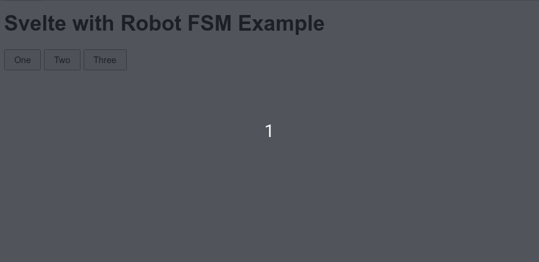

# svelte-robot-fsm-example

> :robot: How to use Robot FSM to manage UI state in Svelte

This is the example code for my blog post:

[Managing Svelte UI state with Robot FSM](https://codechips.me/svelte-and-robot-fsm/)

## How to run

Clone and run `pnpm install && pnpm run dev`.

## There is more!

For more interesting stuff like this follow me on [Twitter](https://twitter.com/codechips) or check out my blog at [codechips.me](https://codechips.me).

